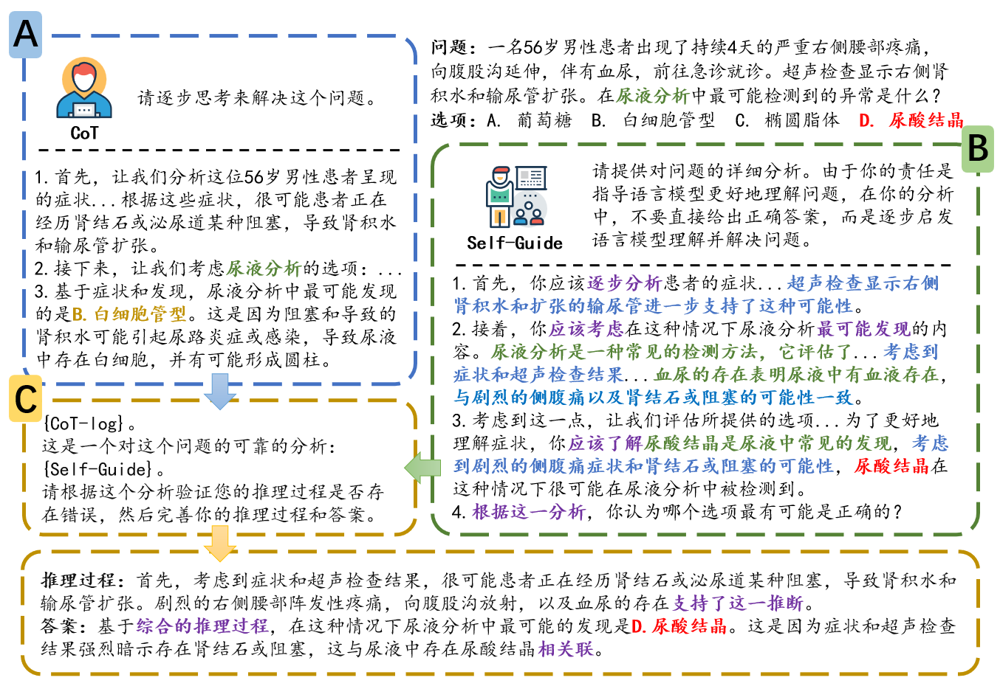

# Self-Guide: A LLM Reasoning Enhancement Method Based on Self-Guided Planning

Source code for our paper :  
***[Self-Guide:一种基于自我规划的大语言模型推理增强方法](https:)***

If you find this work useful, please cite our paper and give us a shining star 🌟

## Overview

Despite significant advancements of LLMs in NLP tasks, they still face cognitive overload issues, especially in domains requiring complex reasoning, where the models need to process and memorize vast amounts of information during the reasoning process. Therefore, it is a pressing issue to effectively reduce the cognitive load during the reasoning process of LLM to alleviate potential cognitive overload. We introduce the Self-Guide method to address the issue, which boosts LLMs' reasoning abilities by leveraging self-generated common sense knowledge and reasoning instructions. Experimental results demonstrate that our Self-Guide method outperforms baseline methods significantly on four common reasoning tasks. By combining the self-planning and reasoning abilities of LLMs, our method provides a new and effective approach to enhance the reasoning ability of LLMs.

<p align="center">
  
</p>

## Quick Start

### Install from git

```bash
git clone https://github.com/10-OASIS-01/Self-Guide
pip install -r requirements.txt
```

##  Run

We also provide the full request code, you can re-request for further exploration.

First, set your own api-key in run file:

```python
openai.api_key = 'sk-<your-api-key>'
```

Then, run the following script:

```bash
python run.py --dataset CLUTRR --start_index 0
```

Analyzing log files:

```bash
python build.py --dataset CLUTRR
```

Evaluate:

```bash
python evaluate.py --dataset CLUTRR
```


## Citation
```
Coming Soon！
```

## Contact Us

If you have questions, suggestions, and bug reports, please send a email to us, we will try our best to help you. 

```bash
kelvin.lau.cn@outlook.com 
```

